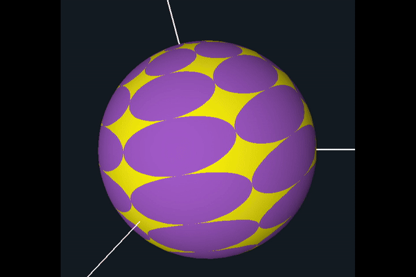

# CS 457 - Computer Graphics Shaders

Here is a summary of my projects from the CS 457 - Computer Graphics Shaders course, taught by Dr. Mike Bailey. During this course, I explored different types of shaders, including vertex, tessellation, geometry, fragment, and compute shaders. I applied these concepts by creating various shader effects and techniques, utilizing C++ alongside OpenGL and GLSL for implementation.

## Step- and Blended-edged Elliptical Dots

## Noisy Elliptical Dots

## Displacement Mapping, Bump Mapping, and Lighting

## Cube Mapping Reflective and Refractive Bump-mapped Surfaces

## Image Manipulation

## The Bunny Menagerie project

## Geometry Shaders: Quantizing in Cylindrical Coordinates

